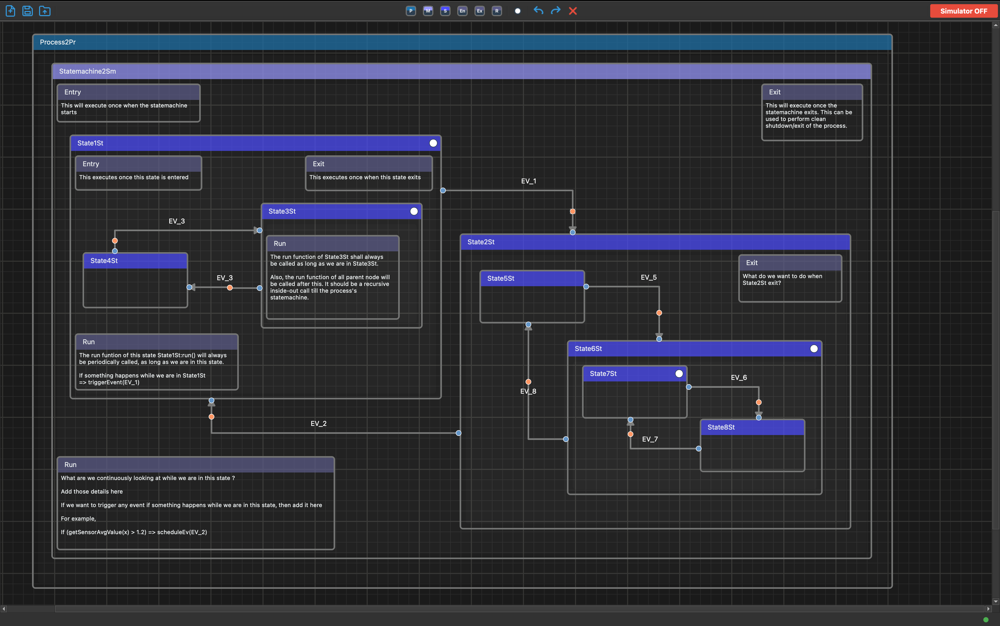

# The Modeller - Hierarchical State Machine Editor

**Version 1.1.0**

AI powered software modeling tool with hierarchical state machine simulation and code generation capabilities.

## Example

Here's an example showing the hierarchical structure with Process → StateMachine → State → Entry/Exit/Run nodes:



The example demonstrates:
- **Process nodes** (blue) containing StateMachines
- **StateMachine nodes** (light purple) containing States
- **State nodes** (dark purple) with hierarchical nesting
- **Entry nodes** (purple, top-left) marking state entry points
- **Exit nodes** (purple, top-right) marking state exit points
- **Run nodes** (purple, bottom-left) for execution logic
- **Transitions** (edges) connecting states with event labels

## Features

### Node Management
- Create and organize nodes in a hierarchical structure
- Container nodes that can hold child nodes
- Nested node support with unlimited depth
- Drag and drop nodes
- Resize nodes using bottom-right handle
- Change node types (StateMachine/State) with toolbar buttons
- Mark State nodes as initial states (shows white circle indicator)
- Double-click to edit node titles
- Delete nodes via toolbar button or Delete/Backspace keys

### Edge Management
- Orthogonal (90-degree angle) edge routing between nodes
- Draggable blue endpoint controls to adjust connection points
- Draggable orange waypoint control to adjust edge bend position
- Double-click edge title to edit
- Proportional waypoint movement with endpoint changes
- Edges automatically update when parent nodes move (recursive for all nested children)
- Wider hit area for easier edge selection
- Delete edges via toolbar button or Delete/Backspace keys

### File Management
- **Save designs** to JSON files (Ctrl+S)
- **Load designs** from JSON files (Ctrl+O)
- **New design** to clear current work and start fresh (Ctrl+N)
- Complete design persistence including:
  - All nodes (top-level and nested children)
  - Parent-child relationships
  - Node positions, sizes, and types
  - Initial state markers for State nodes
  - All edges with connection points and waypoints
  - Edge titles

### Undo/Redo
- **Full undo/redo support** for all operations (Ctrl+Z / Ctrl+Y)
- Supports undoing/redoing:
  - Node movements (captures full drag distance)
  - Node creation and deletion
  - Node type changes
  - Node resizing
  - Initial state marking
  - Edge creation and deletion
  - Edge connection point adjustments
  - Edge waypoint adjustments
  - Node and edge title changes
- Undo stack size: 50 actions
- Redo stack automatically managed

### Simulator Mode
- **Toggle Simulator ON/OFF** via toolbar button
- **Hierarchical state machine execution**:
  - Automatic initial state detection and entry
  - Recursive child state entry (enters initial child of containers)
  - State transition validation (source and hierarchy checks)
  - Click edge control points (orange or blue dots) to trigger transitions
- **Visual feedback**:
  - Active state: 5px orange border
  - Yellow smiley face (😊) indicator on active state
  - State path display in status bar (e.g., "StateMachine → State2 → State4")
- **Complete read-only protection**:
  - All editing disabled (no create/delete/move/resize)
  - No title editing, no edge adjustments
  - No rubber band selection
  - Context menus disabled
- **Transition guards**:
  - Only allows transitions from current state or ancestors
  - Prevents invalid transitions with informative messages
  - Blocks transitions to states already in hierarchy

### Naming Conventions
- **Edges**: EV_1, EV_2, EV_3, ... (Event naming)
- **States**: State1St, State2St, State3St, ...
- **StateMachines**: Statemachine1Sm, Statemachine2Sm, ...
- Sequential numbering with type suffixes

### UI Features
- Zoom in/out with mouse wheel
- Pan around the canvas
- Toolbar with delete button and simulator toggle
- Keyboard shortcuts (Delete/Backspace for deletion)
- Modern UI with Fusion style
- Grid background with major/minor lines
- Color-coded node types (green for StateMachine, darker green for State)

## Requirements
- Python 3.6+
- PyQt5

## Installation

1. Clone this repository:
   ```bash
   git clone https://github.com/choudhariashish/modeller.git
   cd modeller
   ```

2. Create a virtual environment:
   ```bash
   python3 -m venv venv
   source venv/bin/activate  # On Windows use: venv\Scripts\activate
   ```

3. Install dependencies:
   ```bash
   pip install PyQt5
   ```

## Usage

Run the application:
```bash
python3 modeller.py
```

### Controls

#### File Operations
- **Ctrl+N**: New design (clear current work)
- **Ctrl+S**: Save design to JSON file
- **Ctrl+O**: Load design from JSON file
- **Ctrl+Q**: Exit application

#### Undo/Redo
- **Ctrl+Z**: Undo last action
- **Ctrl+Y**: Redo last undone action
- **Toolbar buttons**: Undo and Redo buttons available in toolbar

#### View Controls
- **Mouse Wheel**: Zoom in/out
- **Ctrl++**: Zoom in
- **Ctrl+-**: Zoom out
- **Ctrl+0**: Reset zoom
- **Right-click + Drag**: Pan around the canvas

#### Node Operations
- **Left-click + Drag**: Select/Move nodes
- **Drag bottom-right handle**: Resize node
- **Double-click node title**: Edit node title
- **Right-click**: Context menu for adding nodes
- **Toolbar buttons**: 
  - **StateMachine**: Apply StateMachine type (green title bar)
  - **State**: Apply State type (darker green title bar)
  - **Initial**: Mark selected State node as initial (toggles white circle indicator)

#### Edge Operations
- **Ctrl + Click + Drag**: Create edge between nodes
- **Drag blue dots**: Adjust edge connection points on nodes
- **Drag orange dot**: Adjust edge waypoint (bend position)
- **Double-click edge title**: Edit edge title

#### Deletion
- **Delete/Backspace**: Delete selected items
- **Toolbar Delete Button**: Delete selected items

#### Simulator Mode
- **Simulator ON/OFF Button**: Toggle between editor and simulator modes
- **In Simulator Mode**:
  - Click on edge dots (orange or blue) to trigger state transitions
  - View current state path in status bar
  - Active state shows orange border and yellow smiley face
  - All editing is disabled

## Version History

### Version 1.1.0 (2025-11-26)
- Added Run node type for execution logic inside StateMachine and State nodes
- Entry, Exit, and Run nodes with editable text boxes
- Auto-positioning: Entry (top-left), Exit (top-right), Run (bottom-left)
- Text box resizing with node borders
- Fixed node size restoration after file load
- Added state machine example image to README
- Improved node hierarchy documentation

### Version 1.0.0 (2025-11-21)
- Initial release with complete hierarchical state machine modeling
- Full simulator mode with state transition validation
- Undo/Redo support for all operations
- JSON import/export
- Modern UI with toolbar and keyboard shortcuts
- Automatic naming conventions for edges and states

## License
MIT
